# README

## Project08_REST_API

> 오늘 프로젝트는 commit을 상세히 남기며 했다.

### Startproject : api

- `settings.py`

  ```python
  INSTALLED_APPS = [
      'movies',
      'drf_yasg',
      'rest_framework',
  ]
  ```

- `urls.py`

  ```python
  from django.contrib import admin
  from django.urls import path, include
  from drf_yasg.views import get_schema_view
  from drf_yasg import openapi
  
  schema_view = get_schema_view(
      openapi.Info(
          title = 'Movie API',
          default_version = 'v1',
      ),
  )
  
  urlpatterns = [
      path('admin/', admin.site.urls),
      path('api/v1/', include('movies.urls')),
      path('redoc/', schema_view.with_ui('redoc')),
      path('swagger/', schema_view.with_ui('swagger')),
  ]
  ```

### Startapp : movies

#### 요구사항

##### 1. 데이터베이스 설계

- `models.py`

  ```python
  from django.db import models
  from django.conf import settings
  
  # Create your models here.
  class Genre(models.Model):
      name = models.CharField(max_length=100)
      def __str__ (self):
          return self.name
  
  class Movie(models.Model):
      title = models.CharField(max_length=100)
      audience = models.IntegerField()
      poster_url = models.CharField(max_length=100)
      description = models.TextField()
      genre = models.ForeignKey(Genre, on_delete=models.CASCADE)
      def __str__(self):
          return self.title
  
  class Review(models.Model):
      content = models.CharField(max_length=100)
      score = models.IntegerField()
      movie = models.ForeignKey(Movie, on_delete=models.CASCADE)
      def __str__(self):
          return self.content
  ```

##### 2. Seed Data 반영

```bash
$ python manage.py loaddata genre.json
Installed 11 object(s) from 1 fixture(s)
$ python manage.py loaddata movie.json
Installed 10 object(s) from 1 fixture(s)
```

- admin에서 확인한 결과
  - genre.json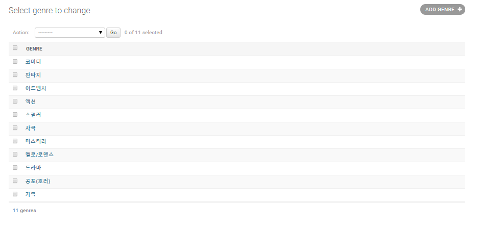
  - movie.json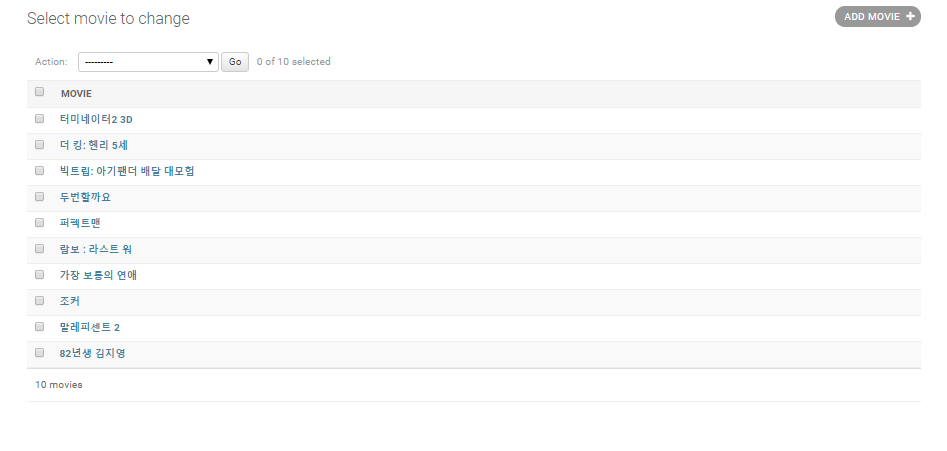


##### 3. Movies API

- `urls.py`

  ```python
  from django.urls import path
  from . import views
  
  urlpatterns = [
      path('genres/', views.genres),
      path('genres/<int:genre_pk>/', views.genre_detail),
      path('movies/', views.movies),
      path('movies/<int:movie_pk>/', views.movie_detail),
      path('movies/<int:movie_pk>/reviews/', views.review_create),
      path('reviews/<int:review_pk>/', views.review_detail),
  ]
  ```

- `serializers.py`

  ```python
  from rest_framework import serializers
  from .models import Genre, Movie, Review
  
  class GenreSerializer(serializers.ModelSerializer):
      class Meta:
          model = Genre
          fields = "__all__"
  
  class MovieSerializer(serializers.ModelSerializer):
      class Meta:
          model = Movie
          fields = "__all__"
  
  class ReviewSerializer(serializers.ModelSerializer):
      class Meta:
          model = Review
          fields = ('content', 'score', 'movie',)
  
  class GenreDetailSerializer(serializers.ModelSerializer):
      movies = MovieSerializer(source="movie_set", many=True)
      class Meta:
          model = Genre
          fields = ('id', 'movies', 'name')
  ```

- `views.py`

  ```python
  from django.shortcuts import render, get_object_or_404
  from .models import Genre, Movie, Review
  from .serializers import GenreSerializer, MovieSerializer, ReviewSerializer, GenreDetailSerializer
  from rest_framework.decorators import api_view
  from rest_framework.response import Response
  
  @api_view(['GET'])
  def genres(request):
      genre_all = Genre.objects.all()
      serializer = GenreSerializer(genre_all, many=True)
      return Response(serializer.data)
  
  @api_view(['GET'])
  def genre_detail(request, genre_pk):
      genre = get_object_or_404(Genre, id=genre_pk)
      serializer = GenreDetailSerializer(genre)
      return Response(serializer.data)
  
  @api_view(['GET'])
  def movies(request):
      movie_all = Movie.objects.all()
      serializer = MovieSerializer(movie_all, many=True)
      return Response(serializer.data)
  
  @api_view(['GET'])
  def movie_detail(request, movie_pk):
      movie = get_object_or_404(Movie, id=movie_pk)
      serializer = MovieSerializer(movie)
      return Response(serializer.data)
  
  @api_view(['POST'])
  def review_create(request, movie_pk):
      serializer = ReviewSerializer(data=request.data)
      if serializer.is_valid(raise_exception=True):
          serializer.save(movie_id=movie_pk)
          # movie_id로 넣어줘야 하는 이유 : db_sqlite3에 movie_id라고 저장되었기 때문
          return Response({'message': "작성되었습니다."})
          # 입력할 때 {"content": "_", "score": 1, "movie": 1} 이 양식으로 데이터를 넣어줘야 한다.
  
  @api_view(['GET', 'PUT', 'DELETE'])
  def review_detail(request, review_pk):
      review = get_object_or_404(Review, id=review_pk)
      if request.method == 'GET':
          serializer = ReviewSerializer(review)
          return Response(serializer.data)
      elif request.method == 'PUT':
          serializer = ReviewSerializer(data=request.data, instance=review)
          if serializer.is_valid(raise_exception=True):
              serializer.save()
              return Response({'message': '수정되었습니다.'})
      else:
          review.delete()
          return Response({'message': '삭제되었습니다.'})
  ```

> review_detail을 보면 url 경로와 그에 따른 함수들을 여러 개 만들지 않아도 돼서 굉장히 편했다.

###### 1. GET `genres/`

- genre_all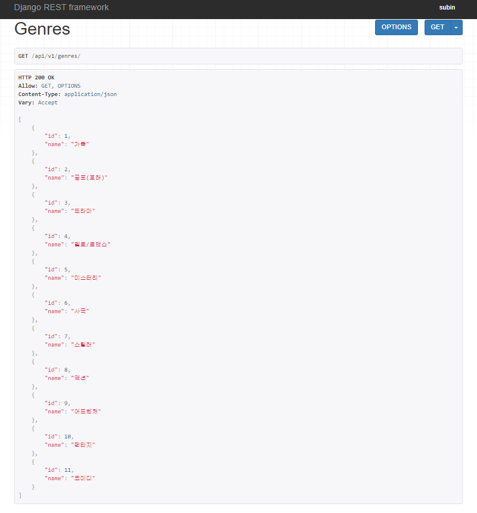

###### 2. GET `genres/{genre_pk}/`

- genre_detail

  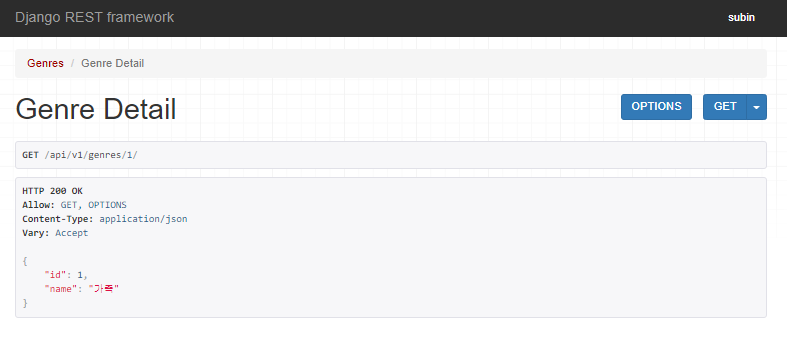

- genre_detail_404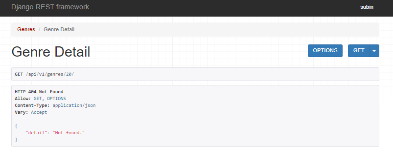

- genre_detail_edit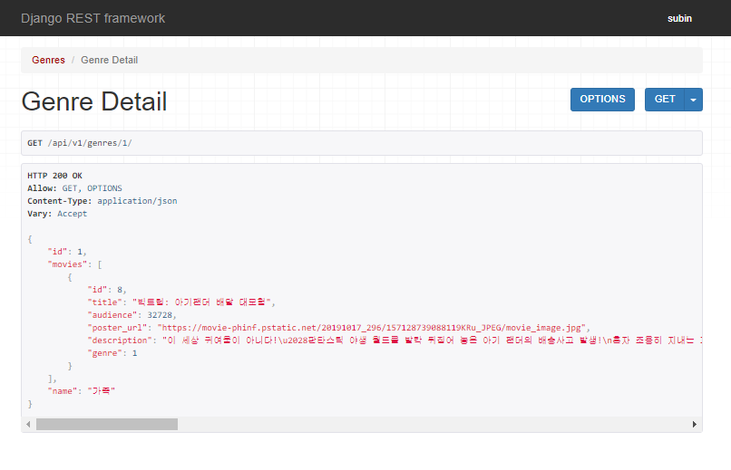

> 처음에 GenreDetailSerializer를 만들 생각을 하지 못해서 GenreSerializer를 가져다 썼었다. 코드 다 짠 후에 GenreDetailSerializer를 만들었다.

###### 3. GET `movies/`

- movie_all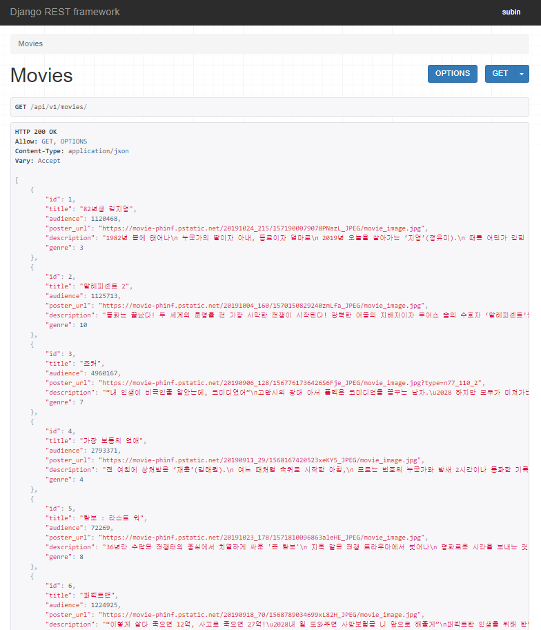

###### 4. GET `movies/{movie_pk}/`

- movie_detail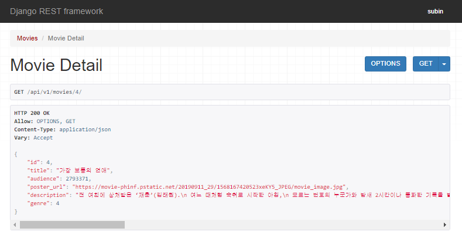
- movie_detail_404

###### 5. POST `movies/{movie_pk}/reviews/`

- review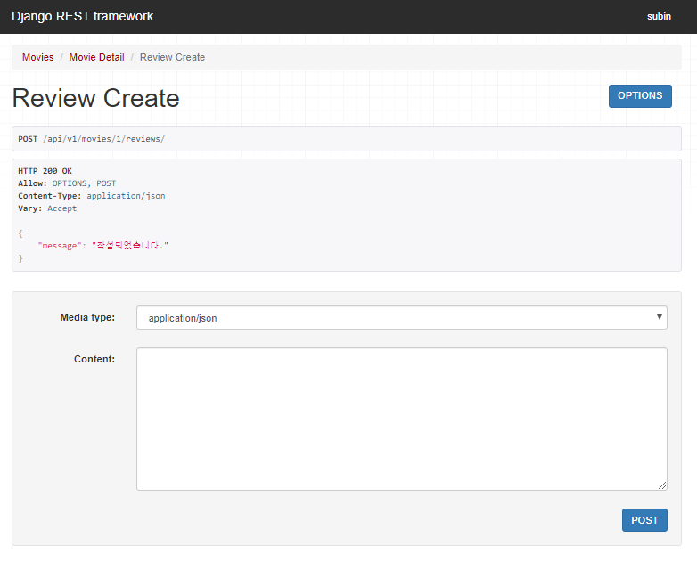
- review_404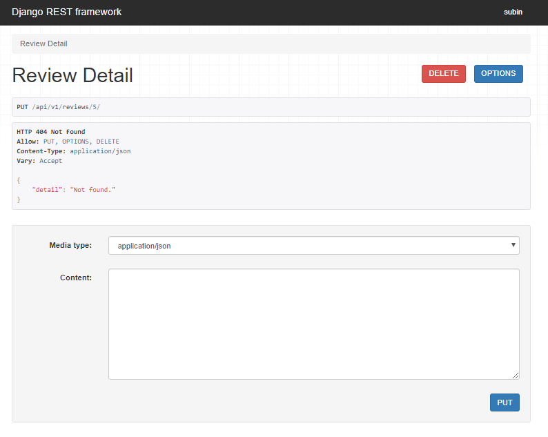
- review_400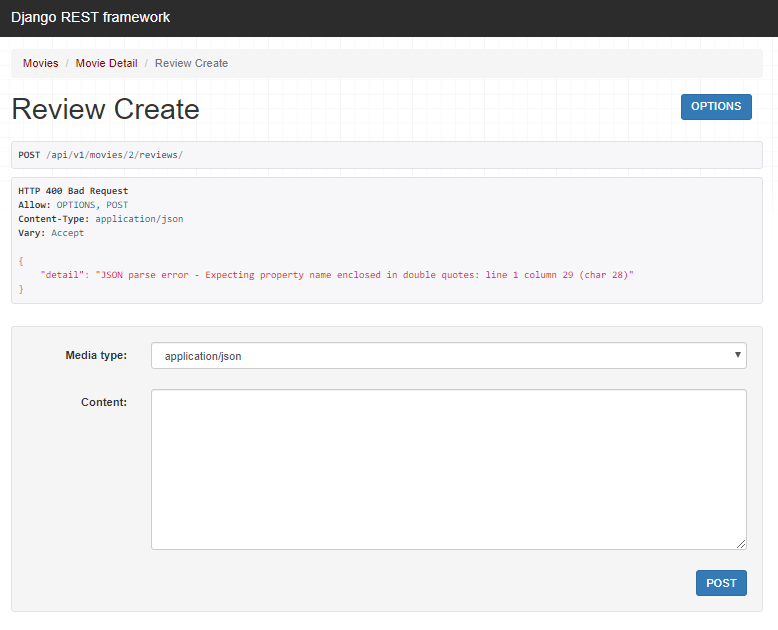

###### 6. PUT `reviews/{review_pk}/`

- review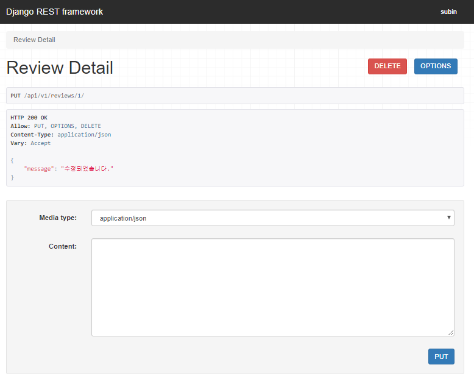
- review_404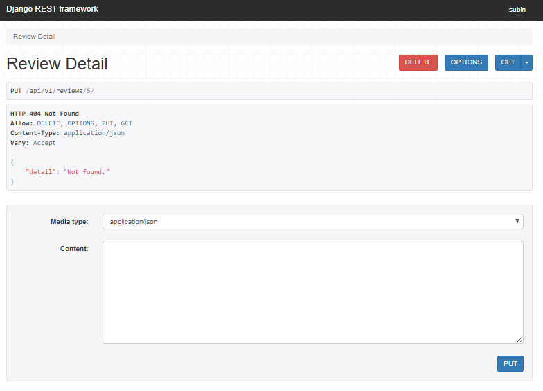
- review_400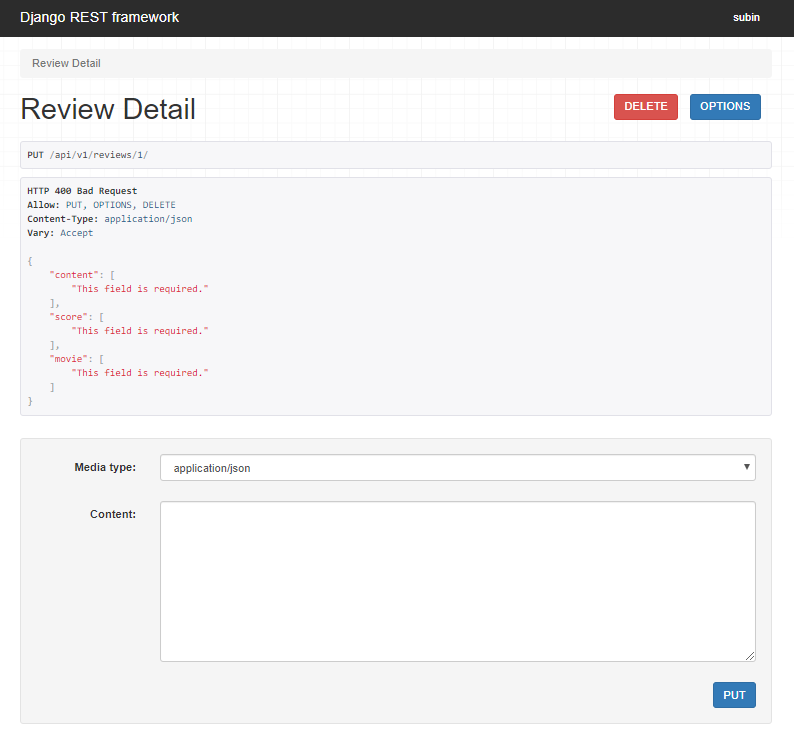

###### 7. DELETE `reviews/{review_pk}/`

- review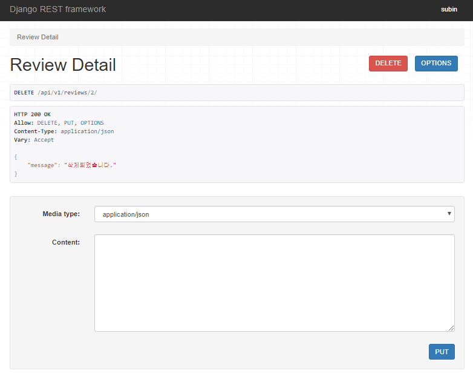
- review_404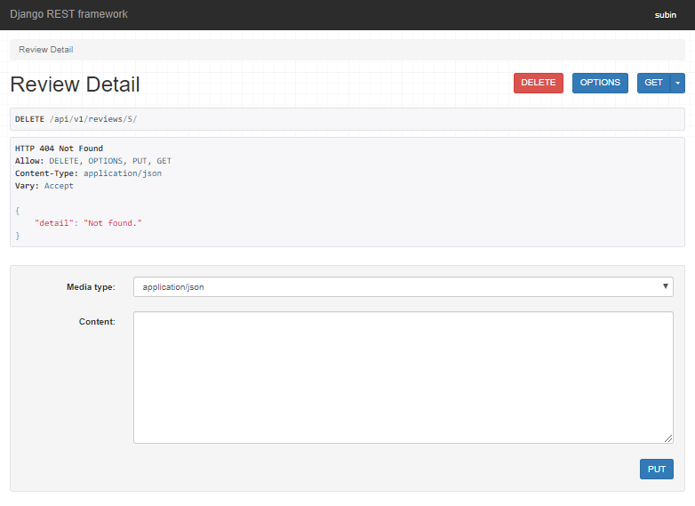

#### API documents

- Movie API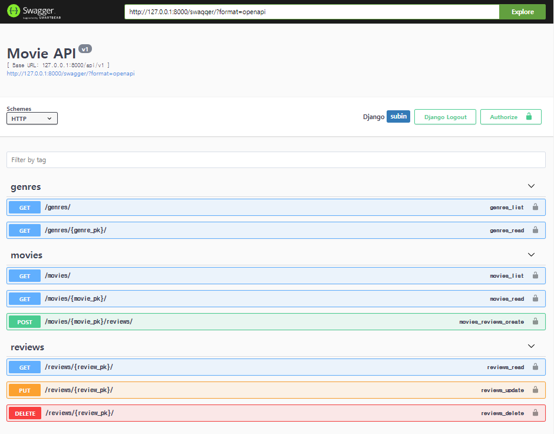

